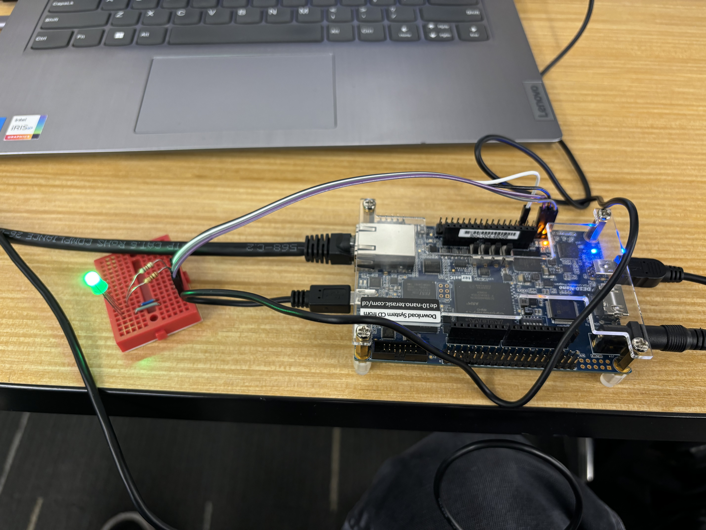
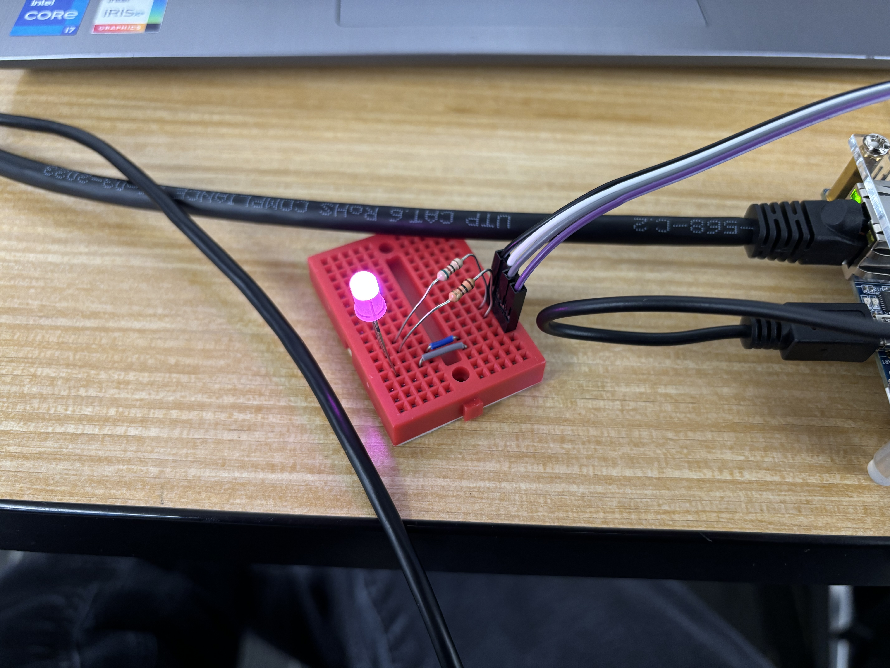

# Homework 10 : RGB LED Controller

## Overview
In this assignment, I created an RGB LED controller using the PWM controller that i made in HW 8.
Controlling an RGB LED is part of the final project. 

## Deliverables
Output images of PWM on the RGB LED (upon my return to bozeman i will add these images)
Red

Green

Blue

Custom Color: Pink

