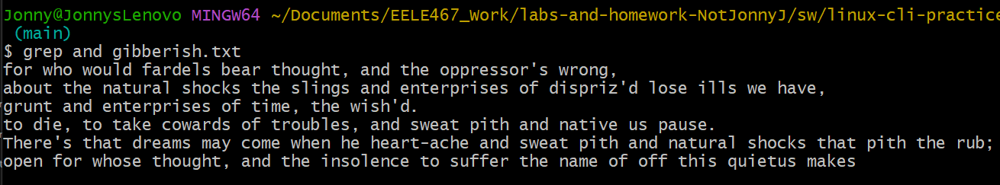

# Homework 7 Linux CLI Practice

## Overview
This assignment is practice with some common Linux CLI tools.

### 1. wc -w lorem-ipsum.txt

### 2. wc -m lorem-ipsum.txt

### 3. wc -l lorem-ipsum.txt

### 4. sort -g file-sizes.txt
    This one was to big to screenshot so this is the bottom of the output 

### 5. sort -g -r file-sizes.txt
    This one was to big to screenshot so this is the bottom of the output

### 6. cut -d',' -f3 log.csv

### 7. cut -d',' -f2,3 log.csv

### 8. cut -d',' -f1,4 log.csv

### 9.  head -n 3 gibberish.txt

### 10. tail -n 2 gibberish.txt

### 11. tail -n+2 gibberish.txt

### 12. grep "and" gibberish.txt

### 13. grep -wn "we" gibberish.txt

### 14.  grep -oi -P "To \w+" gibberish.txt

### 15. grep -c "FPGAs" fpgas.txt

### 16. grep -P "(hot|not|cower|tower|smile|compile)" fpgas.txt

### 17. grep -rc -H "^--" hdl/

    I dont think "CPU topo ever appeared in dmesg
 

### 18. ls > ls-output.txt

### 19. sudo dmesg | grep "CPU topo"

### 20. find hdl/ -iname '*.vhd'

### 21. find hdl/ -iname '*.vhd' | xargs grep -oc  "^--" | wc -l

### 22. grep -n "FPGAs" fpgas.txt

### 23.  du -hc * | sort -rh | head -n 4

