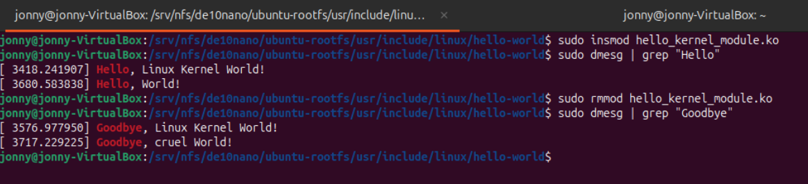
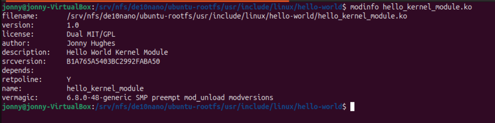
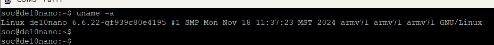

# HW 8 “Hello World” Linux Kernel Module

## Overview
The goal of this homework is to introduce some basic concepts about Linux kernel modules and learn how
to compile them. You will create a “Hello World” kernel module and use dmesg and grep, two common
Unix utilities, to find debug messages you printed from your kernel module.

## Deliverables

After makeing the kernel module I was able to perform some tests to see it in action.


1. This is a screenshot of my ubuntu VM with an insert and remove. 
The message shows two entrys and that is because I was testing before hand.



2. In this screenshot you can see the output of the kernel module 
when it is compiled for the ARM cpu and ran using putty over USB.
Again there are two messages when i ```dmesg | grep``` but this is because I 
did this once before taking a screenshot.


3. This screenshot shows the ```modinfo``` of the module where you can see im the author.



4. This is the description of my file system pulled from the putty termianl.

