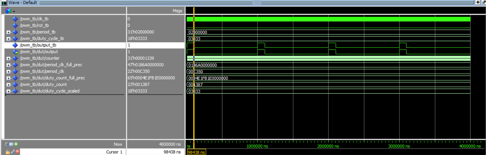
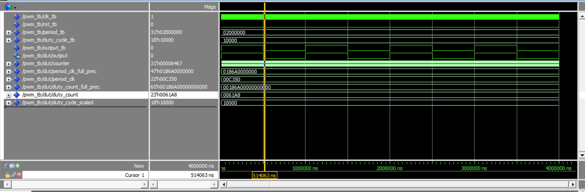
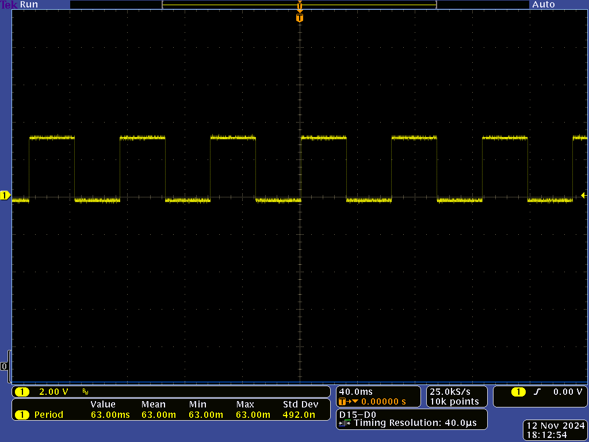

# HW 9 PWM Controller 

## Overview
I created a PWM controller that will be used in the final project to control an RGB LED. I will test the PWM controller by instantiating it in the FPGA fabric and mapping the PWM output to a GPIO pin. I also veridfied the PWM controller is working by looking at PWM output on an oscilloscope.

## Deliverables
This is a simulation of my PWM controller working in Questa. The shown signal has a period of 1 ms and a duty cycle of 10%

This is a simulation of my PWM controller working in Questa. The shown signal has a period of 1 ms and a duty cycle of 50%

This is a screenshot of the output on an oscilloscope. The shown signal has a period of 63 ms and a duty cycle of 50%

