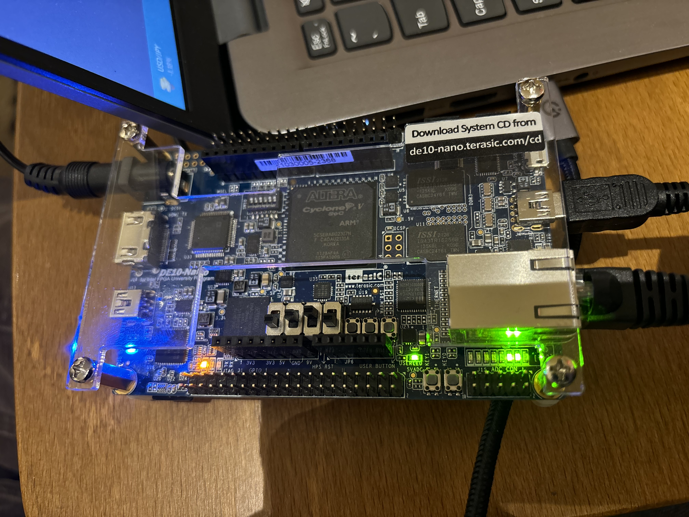
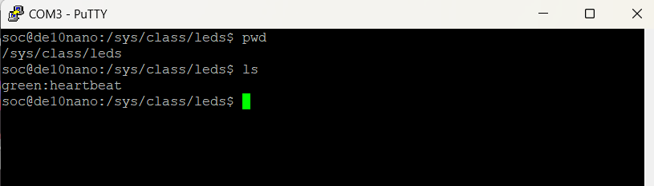

# Lab 10 : Device Trees

## 1. Project Overview

In this lab I make and modify device trees to inform Linux about our custom hardware. This enables device drivers to interact with our custom hardware.

## 2. System Architecture
### Picture of heartbeat LED On

### Screenshot of directory name changed to green:heartbeat

## 3. 
