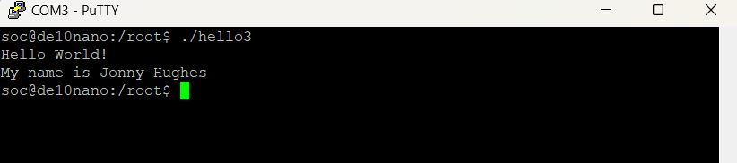

# Lab 3 Developer’s Setup

## Overview
In Lab 3, I configured the FPGA environment to allow the DE10-Nano board to boot from the Ubuntu VM.

In this lab I was able to configure both an NFS and TFTP servers to boot the FPGA from the VM. The connection uses a USB to Ethernet adapter that has a static IP assigened to allow a standardized connection everytime i need to boot the FPGA from my laptop.

This connection help devlopment of the FPGA because i will not need to unplug the SD card everytime i want to run a new program on the FPGA.

### Deliverables
Screenshot of the hello world program running on the FPAG using putty:

