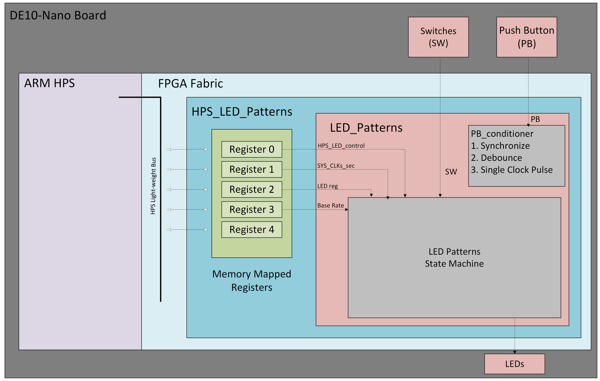
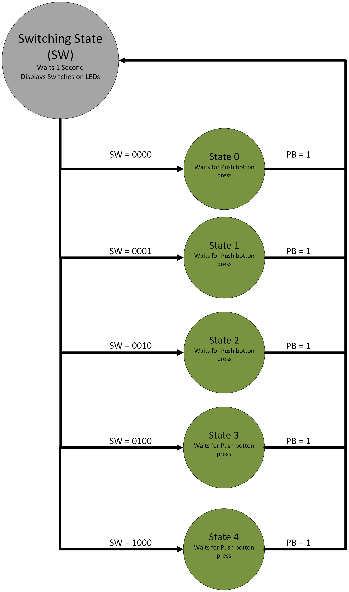

# Lab 4: LED Patterns

## 1. Project Overview

The goal of this project is to implement a hardware state machine that controls the LED array to create patterns on the DE10-nano board. In the led_patterns.vhd component is a hardware stare machine to select differnt patterns as output to the LEDs. The led_patterns component is implamented at the top level of the fpga which is driven by a 50 Mhz clock. 

### Functional Requirements
The led_patterns componet has a couple functional requiremnts to ensure that everything run correctly. The first requiremnt is to ensure the led_patterns run when the hardware control mode signal (hps_led_control) is set to 0. This only allows control of leds to the state machine when not using the LED_reg as input. 
To build the led_paterns componet there are many subcomponents that make up the led_patterns. These files include a clock generator, and a button conditioner. The clock genreator takes the incoming clock of the FPGA and a desired transition base rate to make a 2, 1, 0.5, 0.25, and 0.125 second clocks.The DE10-nanos 8-bit LED array will be driven by the differert clocks of the clock gen component. 
The second requiremnt is the correct LED output in each mode. The output array of LEDs are numbered 0 to 7 and the mode of LED7 is different then the rest. LED7 will always be falshing every 1 second, driven by the 1 second from clock gen, this is called the base rate. The other LEDs 0 through 6 are driven by state machine selected subcomponents; this depends on the postion of the FPGAs switches. 
The last requiremnt is about the state transitions. When the device is running the changing of states only occurs when the push button is pressed. The switches can change during the time and when there is an input from the push button the state machine will change to whatever state the switches are in. After the button press event a timer is started for one second. While the timer is running for one second the current state of the switches is displayed and LED7 is deactivated until the state changes back to pattern state.  

## 2. System Architecture
### Block Diagram

### State Diagram

## 3. Implementation Details
There are five different subcomonent state. When all switches are off the state machine selects state zero and leds 0 through 6 are diven by a walking one led across the array, this is shifting to the right at 1/2 the base rate. In state one the output is two side by side LEDs that are rotating left at 1/4 the base rate. In state 2 the leds are a 7 bit up counter running at 2 times the base rate. In state 3 the leds are a 7-bit down counter moving at 1/8 the base rate. and in state 4 the leds show three side by side leds rotating left at 2 times the base rate. 

