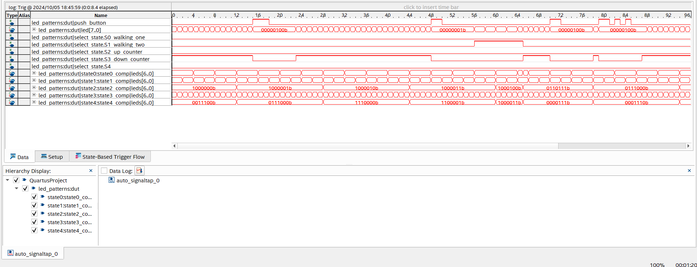
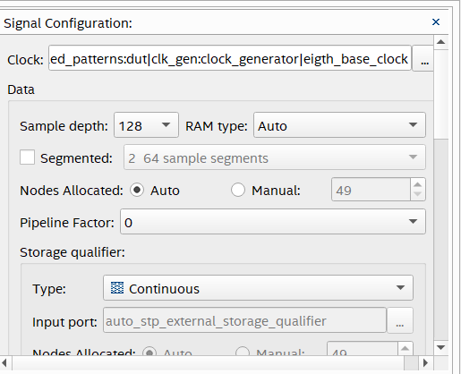

# Lab 5
## Overview
In this lab i used the signal tap tool in Quartus to analyze the sates of led_patterns on the FPGA.

## Deliverables
### Signal Tap Output Waveform

###

### Questions 

> How much FPGA on-chip memory was required to monitor your signals?

The logic analyzer only uses 2 of the 553 Medium blocks which was a total of 6272 bits.

