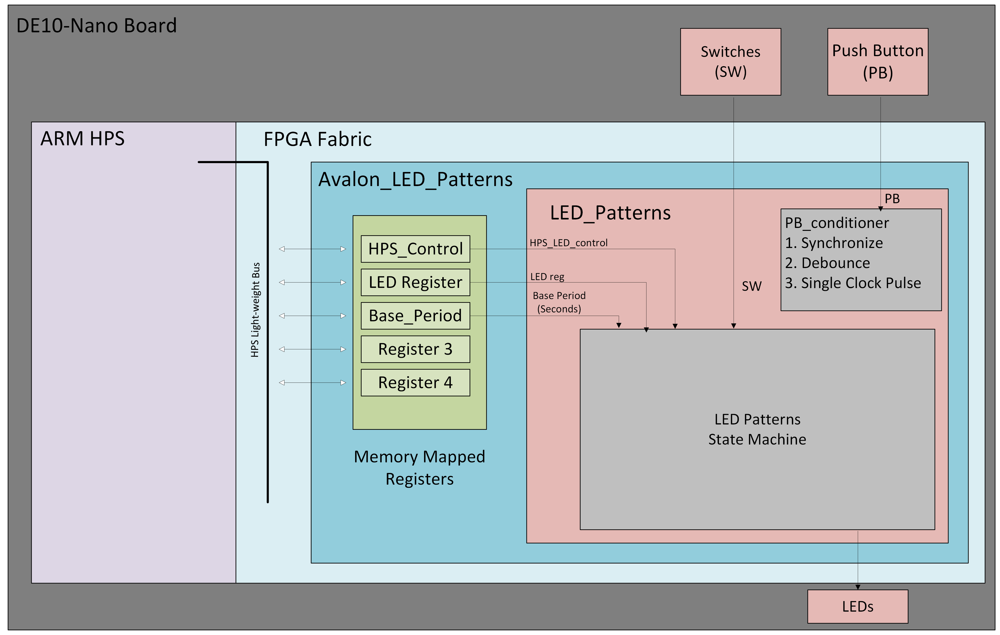

# Lab 6
## Project Overview
In this lab I instatiated the bridge between the on board ARM Processor and the FPGA logic blocks. 

## Deliverables: 

## 1. System Architecture
### Block Diagram
In the block diagram, the avalon component is wrapping around the LED patterns component becasue the avalon componet controlls the LED patterns by chagning the values of the Hardware Registers seen in green.

## 2. Register Map
### Reg 0 : HPS Control Register

### Reg 1 : LED Control Register

### Reg 2 : Base Period Control Register

## 3. Platform Designer Questions
    1. How did you connect these registers to the ARM CPUs in the HPS?
    
    I connected the registers to the ARM CPU by first assigning space in memory for all of the registers needed. Then i assigned values to each register that correspond to the input of the LED Patterns component.

    2. What is the base address of your component in your Platform Designer system?

    I beleive the component is located at base address 0xFF200000.

